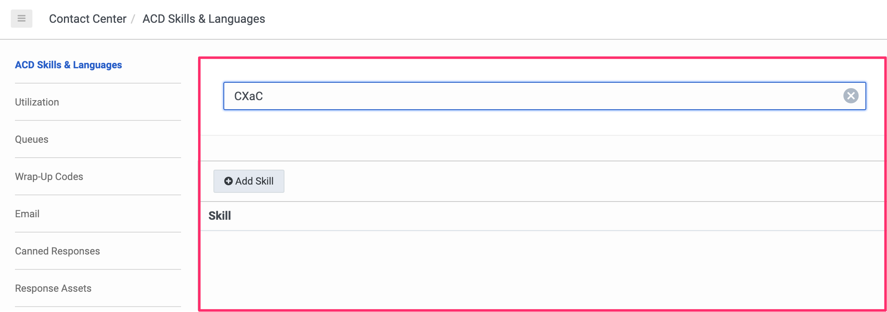

# Notes on *Create Skill* example
## Verify in GCX UI that the resources do not yet exist...


## Terraform init...

Initialize the Terraform environment with the `terraform init` command
```
ara@anfield.local:01-Create Skills $ terraform init

Initializing the backend...

Initializing provider plugins...
- Finding mypurecloud/genesyscloud versions matching ">= 1.14.0"...
- Installing mypurecloud/genesyscloud v1.16.0...
- Installed mypurecloud/genesyscloud v1.16.0 (signed by a HashiCorp partner, key ID 14124804A3595BCF)

Partner and community providers are signed by their developers.
If you'd like to know more about provider signing, you can read about it here:
https://www.terraform.io/docs/cli/plugins/signing.html

Terraform has created a lock file .terraform.lock.hcl to record the provider
selections it made above. Include this file in your version control repository
so that Terraform can guarantee to make the same selections by default when
you run "terraform init" in the future.

Terraform has been successfully initialized!

You may now begin working with Terraform. Try running "terraform plan" to see
any changes that are required for your infrastructure. All Terraform commands
should now work.

If you ever set or change modules or backend configuration for Terraform,
rerun this command to reinitialize your working directory. If you forget, other
commands will detect it and remind you to do so if necessary.
```
## Terraform plan...

Run the `terraform plan` command to see what will happen when you apply this script...
```
ara@anfield.local:01-Create Skills $ terraform plan

Terraform used the selected providers to generate the following execution plan. 
Resource actions are indicated with the following symbols:
  + create

Terraform will perform the following actions:

  # genesyscloud_routing_skill.cxac_example_skill will be created
  + resource "genesyscloud_routing_skill" "cxac_example_skill" {
      + id   = (known after apply)
      + name = "CXaC_Example_Skill_ARA"
    }

Plan: 1 to add, 0 to change, 0 to destroy.

─────────────────────────────────────────────────────────────────────────────────────────────────────────────────────────────────────────────────────────

Note: You didn't use the -out option to save this plan, so Terraform can't guarantee to take exactly these actions if you run "terraform apply" now.
```
## Terraform apply...

Run the `terraform apply` command to create the resources.  NOTE: You must type 'yes' at the prompt to continue!
```
ara@anfield.local:01-Create Skills [main *] $ terraform apply

Terraform used the selected providers to generate the following execution plan. Resource actions are indicated with the following symbols:
  + create

Terraform will perform the following actions:

  # genesyscloud_routing_skill.cxac_example_skill will be created
  + resource "genesyscloud_routing_skill" "cxac_example_skill" {
      + id   = (known after apply)
      + name = "CXaC_Example_Skill_ARA"
    }

Plan: 1 to add, 0 to change, 0 to destroy.

Do you want to perform these actions?
  Terraform will perform the actions described above.
  Only 'yes' will be accepted to approve.

  Enter a value: yes

genesyscloud_routing_skill.cxac_example_skill: Creating...
genesyscloud_routing_skill.cxac_example_skill: Creation complete after 1s [id=172f04b1-c731-4763-9c6e-1760ee6b6c45]

Apply complete! Resources: 1 added, 0 changed, 0 destroyed.
ara@anfield.local:01-Create Skills [main *] $ 
```
## Verify...

Verify in the UI that the resources were actually created...

## Terraform destroy...

Destroy the resources (optional)
```
ara@anfield.local:01-Create Skills [main *] $ terraform destroy
genesyscloud_routing_skill.cxac_example_skill: Refreshing state... [id=7d77584c-ad89-44bb-8a40-f291c7168f73]

Terraform used the selected providers to generate the following execution plan. Resource actions are indicated with the following symbols:
  - destroy

Terraform will perform the following actions:

  # genesyscloud_routing_skill.cxac_example_skill will be destroyed
  - resource "genesyscloud_routing_skill" "cxac_example_skill" {
      - id   = "7d77584c-ad89-44bb-8a40-f291c7168f73" -> null
      - name = "CXaC_Example_Skill_ARA" -> null
    }

Plan: 0 to add, 0 to change, 1 to destroy.

Do you really want to destroy all resources?
  Terraform will destroy all your managed infrastructure, as shown above.
  There is no undo. Only 'yes' will be accepted to confirm.

  Enter a value: yes

genesyscloud_routing_skill.cxac_example_skill: Destroying... [id=7d77584c-ad89-44bb-8a40-f291c7168f73]
genesyscloud_routing_skill.cxac_example_skill: Destruction complete after 1s

Destroy complete! Resources: 1 destroyed.
ara@anfield.local:01-Create Skills [main *] $ 
```