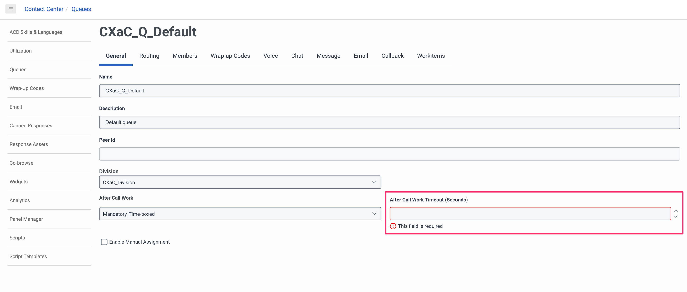
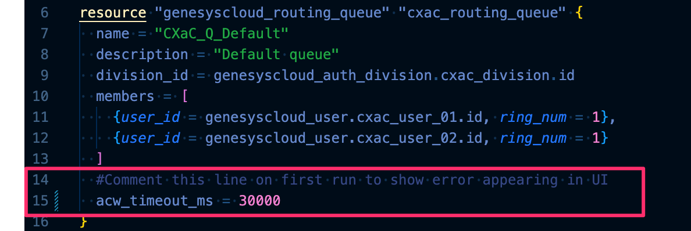
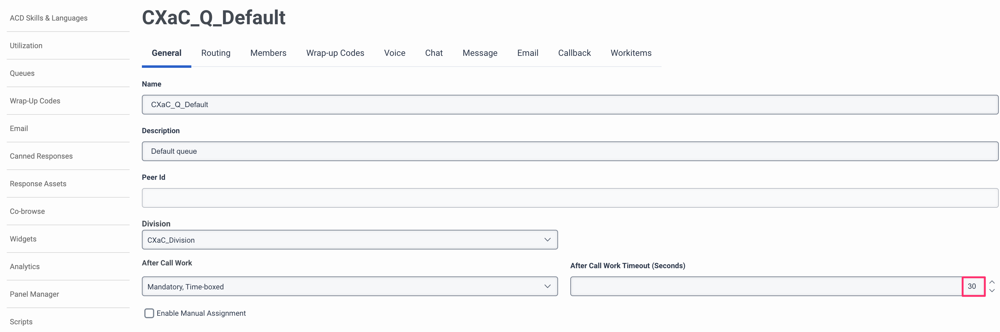

# Notes on *Resource Dependencies* example
## Initialize Terraform environment...
```
ara@anfield.local:02-Data Sources and Dependencies [main *] $ terraform init

Initializing the backend...

Initializing provider plugins...
- Finding mypurecloud/genesyscloud versions matching ">= 1.14.0"...
- Installing mypurecloud/genesyscloud v1.16.0...
- Installed mypurecloud/genesyscloud v1.16.0 (signed by a HashiCorp partner, key ID 14124804A3595BCF)

Partner and community providers are signed by their developers.
If you'd like to know more about provider signing, you can read about it here:
https://www.terraform.io/docs/cli/plugins/signing.html

Terraform has created a lock file .terraform.lock.hcl to record the provider
selections it made above. Include this file in your version control repository
so that Terraform can guarantee to make the same selections by default when
you run "terraform init" in the future.

Terraform has been successfully initialized!

You may now begin working with Terraform. Try running "terraform plan" to see
any changes that are required for your infrastructure. All Terraform commands
should now work.

If you ever set or change modules or backend configuration for Terraform,
rerun this command to reinitialize your working directory. If you forget, other
commands will detect it and remind you to do so if necessary.
ara@anfield.local:02-Data Sources and Dependencies [main *] $
```

## Validate syntax and review the actions...
```
ara@anfield.local:02-Data Sources and Dependencies [main *] $ terraform plan

Terraform used the selected providers to generate the following execution plan. Resource actions are indicated with the following symbols:
  + create

Terraform will perform the following actions:

  # genesyscloud_auth_division.cxac_division will be created
  + resource "genesyscloud_auth_division" "cxac_division" {
      + description = "Division used for CX as Code TOI - Berlin 2023"
      + id          = (known after apply)
      + name        = "CXaC_Division"
    }

  # genesyscloud_routing_queue.cxac_routing_queue will be created
  + resource "genesyscloud_routing_queue" "cxac_routing_queue" {
      + acw_timeout_ms           = (known after apply)
      + acw_wrapup_prompt        = "MANDATORY_TIMEOUT"
      + auto_answer_only         = true
      + description              = "Default queue"
      + division_id              = (known after apply)
      + enable_manual_assignment = false
      + enable_transcription     = false
      + id                       = (known after apply)
      + members                  = [
          + {
              + ring_num = 1
              + user_id  = (known after apply)
            },
          + {
              + ring_num = 1
              + user_id  = (known after apply)
            },
        ]
      + name                     = "CXaC_Q_Default"
      + skill_evaluation_method  = "ALL"
      + wrapup_codes             = (known after apply)
    }

  # genesyscloud_user.cxac_user_01 will be created
  + resource "genesyscloud_user" "cxac_user_01" {
      + acd_auto_answer     = false
      + addresses           = (known after apply)
      + certifications      = (known after apply)
      + division_id         = (known after apply)
      + email               = "cxac-user01@cxac.mypurecloud.de"
      + employer_info       = (known after apply)
      + id                  = (known after apply)
      + locations           = (known after apply)
      + name                = "CXaC User-01"
      + password            = (sensitive value)
      + profile_skills      = (known after apply)
      + routing_languages   = (known after apply)
      + routing_skills      = (known after apply)
      + routing_utilization = (known after apply)
      + state               = "active"
    }

  # genesyscloud_user.cxac_user_02 will be created
  + resource "genesyscloud_user" "cxac_user_02" {
      + acd_auto_answer     = false
      + addresses           = (known after apply)
      + certifications      = (known after apply)
      + division_id         = (known after apply)
      + email               = "cxac-user02@cxac.mypurecloud.de"
      + employer_info       = (known after apply)
      + id                  = (known after apply)
      + locations           = (known after apply)
      + name                = "CXaC User-02"
      + password            = (sensitive value)
      + profile_skills      = (known after apply)
      + routing_languages   = (known after apply)
      + routing_skills      = (known after apply)
      + routing_utilization = (known after apply)
      + state               = "active"
    }

Plan: 4 to add, 0 to change, 0 to destroy.

─────────────────────────────────────────────────────────────────────────────────────────────────────────────────────────────────────────────────────────

Note: You didn't use the -out option to save this plan, so Terraform can't guarantee to take exactly these actions if you run "terraform apply" now.
ara@anfield.local:02-Data Sources and Dependencies [main *] $ 
```

## Execute the Terraform script...
```
ara@anfield.local:02-Data Sources and Dependencies [main *] $ terraform apply --auto-approve

Terraform used the selected providers to generate the following execution plan. Resource actions are indicated with the following symbols:
  + create

Terraform will perform the following actions:

  # genesyscloud_auth_division.cxac_division will be created
  + resource "genesyscloud_auth_division" "cxac_division" {
      + description = "Division used for CX as Code TOI - Berlin 2023"
      + id          = (known after apply)
      + name        = "CXaC_Division"
    }

  # genesyscloud_routing_queue.cxac_routing_queue will be created
  + resource "genesyscloud_routing_queue" "cxac_routing_queue" {
      + acw_timeout_ms           = (known after apply)
      + acw_wrapup_prompt        = "MANDATORY_TIMEOUT"
      + auto_answer_only         = true
      + description              = "Default queue"
      + division_id              = (known after apply)
      + enable_manual_assignment = false
      + enable_transcription     = false
      + id                       = (known after apply)
      + members                  = [
          + {
              + ring_num = 1
              + user_id  = (known after apply)
            },
          + {
              + ring_num = 1
              + user_id  = (known after apply)
            },
        ]
      + name                     = "CXaC_Q_Default"
      + skill_evaluation_method  = "ALL"
      + wrapup_codes             = (known after apply)
    }

  # genesyscloud_user.cxac_user_01 will be created
  + resource "genesyscloud_user" "cxac_user_01" {
      + acd_auto_answer     = false
      + addresses           = (known after apply)
      + certifications      = (known after apply)
      + division_id         = (known after apply)
      + email               = "cxac-user01@cxac.mypurecloud.de"
      + employer_info       = (known after apply)
      + id                  = (known after apply)
      + locations           = (known after apply)
      + name                = "CXaC User-01"
      + password            = (sensitive value)
      + profile_skills      = (known after apply)
      + routing_languages   = (known after apply)
      + routing_skills      = (known after apply)
      + routing_utilization = (known after apply)
      + state               = "active"
    }

  # genesyscloud_user.cxac_user_02 will be created
  + resource "genesyscloud_user" "cxac_user_02" {
      + acd_auto_answer     = false
      + addresses           = (known after apply)
      + certifications      = (known after apply)
      + division_id         = (known after apply)
      + email               = "cxac-user02@cxac.mypurecloud.de"
      + employer_info       = (known after apply)
      + id                  = (known after apply)
      + locations           = (known after apply)
      + name                = "CXaC User-02"
      + password            = (sensitive value)
      + profile_skills      = (known after apply)
      + routing_languages   = (known after apply)
      + routing_skills      = (known after apply)
      + routing_utilization = (known after apply)
      + state               = "active"
    }

Plan: 4 to add, 0 to change, 0 to destroy.
genesyscloud_auth_division.cxac_division: Creating...
genesyscloud_auth_division.cxac_division: Creation complete after 0s [id=fd95d2c6-e2b6-4974-becc-5568e369a837]
genesyscloud_user.cxac_user_01: Creating...
genesyscloud_user.cxac_user_02: Creating...
genesyscloud_user.cxac_user_02: Creation complete after 2s [id=b3ce7a24-84dc-4f80-b7ba-169ad4d09bf0]
genesyscloud_user.cxac_user_01: Creation complete after 4s [id=13d04497-91f7-4a8f-bf48-60b93252a0eb]
genesyscloud_routing_queue.cxac_routing_queue: Creating...
genesyscloud_routing_queue.cxac_routing_queue: Creation complete after 1s [id=bd2c02f8-f50d-4afc-a28a-42f987d61f9f]

Apply complete! Resources: 4 added, 0 changed, 0 destroyed.
ara@anfield.local:02-Data Sources and Dependencies [main *] $ 
```

## Review in GCX UI

Note that we forgot to add the ACW Timeout to the queue by reviewing resource in GCX UI


Uncomment the code for ACW and run `terraform apply` again

```
ara@anfield.local:02-Data Sources and Dependencies [main *] $ terraform apply --auto-approve
genesyscloud_auth_division.cxac_division: Refreshing state... [id=fd95d2c6-e2b6-4974-becc-5568e369a837]
genesyscloud_user.CXaC User_02: Refreshing state... [id=b3ce7a24-84dc-4f80-b7ba-169ad4d09bf0]
genesyscloud_user.cxac_user_01: Refreshing state... [id=13d04497-91f7-4a8f-bf48-60b93252a0eb]
genesyscloud_routing_queue.cxac_routing_queue: Refreshing state... [id=bd2c02f8-f50d-4afc-a28a-42f987d61f9f]

Terraform used the selected providers to generate the following execution plan. Resource actions are indicated with the following symbols:
  ~ update in-place

Terraform will perform the following actions:

  # genesyscloud_routing_queue.cxac_routing_queue will be updated in-place
  ~ resource "genesyscloud_routing_queue" "cxac_routing_queue" {
      ~ acw_timeout_ms           = 0 -> 30000
        id                       = "bd2c02f8-f50d-4afc-a28a-42f987d61f9f"
        name                     = "CXaC_Q_Default"
        # (13 unchanged attributes hidden)

        # (5 unchanged blocks hidden)
    }

Plan: 0 to add, 1 to change, 0 to destroy.
genesyscloud_routing_queue.cxac_routing_queue: Modifying... [id=bd2c02f8-f50d-4afc-a28a-42f987d61f9f]
genesyscloud_routing_queue.cxac_routing_queue: Modifications complete after 1s [id=bd2c02f8-f50d-4afc-a28a-42f987d61f9f]

Apply complete! Resources: 0 added, 1 changed, 0 destroyed.
ara@anfield.local:02-Data Sources and Dependencies [main *] $ 
```
## Review updates...

Note that the ACW timeout value of 30 seconds (30000ms) is now applied

## Destroy the resources created in this script...
```
ara@anfield.local:02-Data Sources and Dependencies [main *] $ terraform destroy 
genesyscloud_auth_division.cxac_division: Refreshing state... [id=fd95d2c6-e2b6-4974-becc-5568e369a837]
genesyscloud_user.cxac_user_01: Refreshing state... [id=13d04497-91f7-4a8f-bf48-60b93252a0eb]
genesyscloud_user.cxac_user_02: Refreshing state... [id=b3ce7a24-84dc-4f80-b7ba-169ad4d09bf0]
genesyscloud_routing_queue.cxac_routing_queue: Refreshing state... [id=bd2c02f8-f50d-4afc-a28a-42f987d61f9f]

Terraform used the selected providers to generate the following execution plan. Resource actions are indicated with the following symbols:
  - destroy

Terraform will perform the following actions:

  # genesyscloud_auth_division.cxac_division will be destroyed
  - resource "genesyscloud_auth_division" "cxac_division" {
      - description = "Division used for CX as Code TOI - Berlin 2023" -> null
      - home        = false -> null
      - id          = "fd95d2c6-e2b6-4974-becc-5568e369a837" -> null
      - name        = "CXaC_Division" -> null
    }

  # genesyscloud_routing_queue.cxac_routing_queue will be destroyed
  - resource "genesyscloud_routing_queue" "cxac_routing_queue" {
      - acw_timeout_ms           = 30000 -> null
      - acw_wrapup_prompt        = "MANDATORY_TIMEOUT" -> null
      - auto_answer_only         = true -> null
      - default_script_ids       = {} -> null
      - description              = "Default queue" -> null
      - division_id              = "fd95d2c6-e2b6-4974-becc-5568e369a837" -> null
      - enable_manual_assignment = false -> null
      - enable_transcription     = false -> null
      - groups                   = [] -> null
      - id                       = "bd2c02f8-f50d-4afc-a28a-42f987d61f9f" -> null
      - members                  = [
          - {
              - ring_num = 1
              - user_id  = "13d04497-91f7-4a8f-bf48-60b93252a0eb"
            },
          - {
              - ring_num = 1
              - user_id  = "b3ce7a24-84dc-4f80-b7ba-169ad4d09bf0"
            },
        ] -> null
      - name                     = "CXaC_Q_Default" -> null
      - skill_evaluation_method  = "ALL" -> null
      - skill_groups             = [] -> null
      - teams                    = [] -> null
      - wrapup_codes             = [] -> null

      - media_settings_call {
          - alerting_timeout_sec      = 8 -> null
          - service_level_duration_ms = 20000 -> null
          - service_level_percentage  = 0.8 -> null
        }

      - media_settings_callback {
          - alerting_timeout_sec      = 30 -> null
          - service_level_duration_ms = 20000 -> null
          - service_level_percentage  = 0.8 -> null
        }

      - media_settings_chat {
          - alerting_timeout_sec      = 30 -> null
          - service_level_duration_ms = 20000 -> null
          - service_level_percentage  = 0.8 -> null
        }

      - media_settings_email {
          - alerting_timeout_sec      = 300 -> null
          - service_level_duration_ms = 86400000 -> null
          - service_level_percentage  = 0.8 -> null
        }

      - media_settings_message {
          - alerting_timeout_sec      = 30 -> null
          - service_level_duration_ms = 20000 -> null
          - service_level_percentage  = 0.8 -> null
        }
    }

  # genesyscloud_user.cxac_user_01 will be destroyed
  - resource "genesyscloud_user" "cxac_user_01" {
      - acd_auto_answer     = false -> null
      - addresses           = [] -> null
      - certifications      = [] -> null
      - division_id         = "fd95d2c6-e2b6-4974-becc-5568e369a837" -> null
      - email               = "cxac-user01@cxac.mypurecloud.de" -> null
      - employer_info       = [] -> null
      - id                  = "13d04497-91f7-4a8f-bf48-60b93252a0eb" -> null
      - locations           = [] -> null
      - name                = "CXaC User-01" -> null
      - password            = (sensitive value) -> null
      - profile_skills      = [] -> null
      - routing_languages   = [] -> null
      - routing_skills      = [] -> null
      - routing_utilization = [] -> null
      - state               = "active" -> null
    }

  # genesyscloud_user.cxac_user_02 will be destroyed
  - resource "genesyscloud_user" "cxac_user_02" {
      - acd_auto_answer     = false -> null
      - addresses           = [] -> null
      - certifications      = [] -> null
      - division_id         = "fd95d2c6-e2b6-4974-becc-5568e369a837" -> null
      - email               = "cxac-user02@cxac.mypurecloud.de" -> null
      - employer_info       = [] -> null
      - id                  = "b3ce7a24-84dc-4f80-b7ba-169ad4d09bf0" -> null
      - locations           = [] -> null
      - name                = "CXaC User-02" -> null
      - password            = (sensitive value) -> null
      - profile_skills      = [] -> null
      - routing_languages   = [] -> null
      - routing_skills      = [] -> null
      - routing_utilization = [] -> null
      - state               = "active" -> null
    }

Plan: 0 to add, 0 to change, 4 to destroy.

Do you really want to destroy all resources?
  Terraform will destroy all your managed infrastructure, as shown above.
  There is no undo. Only 'yes' will be accepted to confirm.

  Enter a value: yes

genesyscloud_routing_queue.cxac_routing_queue: Destroying... [id=bd2c02f8-f50d-4afc-a28a-42f987d61f9f]
genesyscloud_routing_queue.cxac_routing_queue: Destruction complete after 5s
genesyscloud_user.cxac_user_01: Destroying... [id=13d04497-91f7-4a8f-bf48-60b93252a0eb]
genesyscloud_user.cxac_user_02: Destroying... [id=b3ce7a24-84dc-4f80-b7ba-169ad4d09bf0]
genesyscloud_user.cxac_user_01: Destruction complete after 3s
genesyscloud_user.cxac_user_02: Destruction complete after 3s
genesyscloud_auth_division.cxac_division: Destroying... [id=fd95d2c6-e2b6-4974-becc-5568e369a837]
genesyscloud_auth_division.cxac_division: Destruction complete after 0s

Destroy complete! Resources: 4 destroyed.
ara@anfield.local:02-Data Sources and Dependencies [main *] $ 
```
