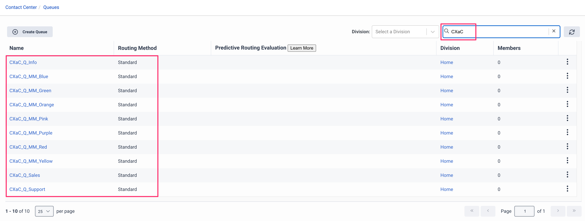

# Notes on *External Resources* example
## Verify in the UI that these resources do not already exist


## Terraform init...

Initialize the Terraform environment with `terraform init` command
```

Initializing the backend...

Initializing provider plugins...
- Finding mypurecloud/genesyscloud versions matching ">= 1.14.0"...
- Installing mypurecloud/genesyscloud v1.16.0...
- Installed mypurecloud/genesyscloud v1.16.0 (signed by a HashiCorp partner, key ID 14124804A3595BCF)

Partner and community providers are signed by their developers.
If you'd like to know more about provider signing, you can read about it here:
https://www.terraform.io/docs/cli/plugins/signing.html

Terraform has created a lock file .terraform.lock.hcl to record the provider
selections it made above. Include this file in your version control repository
so that Terraform can guarantee to make the same selections by default when
you run "terraform init" in the future.

Terraform has been successfully initialized!

You may now begin working with Terraform. Try running "terraform plan" to see
any changes that are required for your infrastructure. All Terraform commands
should now work.

If you ever set or change modules or backend configuration for Terraform,
rerun this command to reinitialize your working directory. If you forget, other
commands will detect it and remind you to do so if necessary.
andrewa@rem-andrewa-m.local:04-External Resources [main *] $ 
```

## Terraform plan...

Run the `terraform plan` command to see what will happen when you apply this script...
```
andrewa@rem-andrewa-m.local:04-External Resources [main *] $ terraform plan

Terraform used the selected providers to generate the following execution plan. Resource actions are indicated with the following symbols:
  + create

Terraform will perform the following actions:

  # genesyscloud_routing_queue.cxac_queues[0] will be created
  + resource "genesyscloud_routing_queue" "cxac_queues" {
      + acw_timeout_ms           = 60000
      + acw_wrapup_prompt        = "AGENT_REQUESTED"
      + auto_answer_only         = true
      + description              = "Queue for CXaC Tech Support Calls"
      + division_id              = (known after apply)
      + enable_manual_assignment = false
      + enable_transcription     = false
      + id                       = (known after apply)
      + members                  = (known after apply)
      + name                     = "CXaC_Q_Support"
      + skill_evaluation_method  = "ALL"
      + wrapup_codes             = (known after apply)
    }

  # genesyscloud_routing_queue.cxac_queues[1] will be created
  + resource "genesyscloud_routing_queue" "cxac_queues" {
      + acw_timeout_ms           = 30000
      + acw_wrapup_prompt        = "MANDATORY_TIMEOUT"
      + auto_answer_only         = true
      + description              = "Queue for CXaC Sales"
      + division_id              = (known after apply)
      + enable_manual_assignment = false
      + enable_transcription     = false
      + id                       = (known after apply)
      + members                  = (known after apply)
      + name                     = "CXaC_Q_Sales"
      + skill_evaluation_method  = "ALL"
      + wrapup_codes             = (known after apply)
    }

  # genesyscloud_routing_queue.cxac_queues[2] will be created
  + resource "genesyscloud_routing_queue" "cxac_queues" {
      + acw_timeout_ms           = 10000
      + acw_wrapup_prompt        = "MANDATORY_FORCED_TIMEOUT"
      + auto_answer_only         = true
      + description              = "Queue for CXaC Info Line"
      + division_id              = (known after apply)
      + enable_manual_assignment = false
      + enable_transcription     = false
      + id                       = (known after apply)
      + members                  = (known after apply)
      + name                     = "CXaC_Q_Info"
      + skill_evaluation_method  = "ALL"
      + wrapup_codes             = (known after apply)
    }

  # genesyscloud_routing_queue.cxac_queues[3] will be created
  + resource "genesyscloud_routing_queue" "cxac_queues" {
      + acw_timeout_ms           = 30000
      + acw_wrapup_prompt        = "MANDATORY_TIMEOUT"
      + auto_answer_only         = true
      + description              = "Queue for Red M&Ms"
      + division_id              = (known after apply)
      + enable_manual_assignment = false
      + enable_transcription     = false
      + id                       = (known after apply)
      + members                  = (known after apply)
      + name                     = "CXaC_Q_MM_Red"
      + skill_evaluation_method  = "ALL"
      + wrapup_codes             = (known after apply)
    }

  # genesyscloud_routing_queue.cxac_queues[4] will be created
  + resource "genesyscloud_routing_queue" "cxac_queues" {
      + acw_timeout_ms           = 30000
      + acw_wrapup_prompt        = "MANDATORY_TIMEOUT"
      + auto_answer_only         = true
      + description              = "Queue for Orange M&Ms"
      + division_id              = (known after apply)
      + enable_manual_assignment = false
      + enable_transcription     = false
      + id                       = (known after apply)
      + members                  = (known after apply)
      + name                     = "CXaC_Q_MM_Orange"
      + skill_evaluation_method  = "ALL"
      + wrapup_codes             = (known after apply)
    }

  # genesyscloud_routing_queue.cxac_queues[5] will be created
  + resource "genesyscloud_routing_queue" "cxac_queues" {
      + acw_timeout_ms           = 30000
      + acw_wrapup_prompt        = "MANDATORY_TIMEOUT"
      + auto_answer_only         = true
      + description              = "Queue for Green M&Ms"
      + division_id              = (known after apply)
      + enable_manual_assignment = false
      + enable_transcription     = false
      + id                       = (known after apply)
      + members                  = (known after apply)
      + name                     = "CXaC_Q_MM_Green"
      + skill_evaluation_method  = "ALL"
      + wrapup_codes             = (known after apply)
    }

  # genesyscloud_routing_queue.cxac_queues[6] will be created
  + resource "genesyscloud_routing_queue" "cxac_queues" {
      + acw_timeout_ms           = 30000
      + acw_wrapup_prompt        = "MANDATORY_TIMEOUT"
      + auto_answer_only         = true
      + description              = "Queue for Blue M&Ms"
      + division_id              = (known after apply)
      + enable_manual_assignment = false
      + enable_transcription     = false
      + id                       = (known after apply)
      + members                  = (known after apply)
      + name                     = "CXaC_Q_MM_Blue"
      + skill_evaluation_method  = "ALL"
      + wrapup_codes             = (known after apply)
    }

  # genesyscloud_routing_queue.cxac_queues[7] will be created
  + resource "genesyscloud_routing_queue" "cxac_queues" {
      + acw_timeout_ms           = 30000
      + acw_wrapup_prompt        = "MANDATORY_TIMEOUT"
      + auto_answer_only         = true
      + description              = "Queue for Yellow M&Ms"
      + division_id              = (known after apply)
      + enable_manual_assignment = false
      + enable_transcription     = false
      + id                       = (known after apply)
      + members                  = (known after apply)
      + name                     = "CXaC_Q_MM_Yellow"
      + skill_evaluation_method  = "ALL"
      + wrapup_codes             = (known after apply)
    }

  # genesyscloud_routing_queue.cxac_queues[8] will be created
  + resource "genesyscloud_routing_queue" "cxac_queues" {
      + acw_timeout_ms           = 30000
      + acw_wrapup_prompt        = "MANDATORY_TIMEOUT"
      + auto_answer_only         = true
      + description              = "Queue for Pink M&Ms"
      + division_id              = (known after apply)
      + enable_manual_assignment = false
      + enable_transcription     = false
      + id                       = (known after apply)
      + members                  = (known after apply)
      + name                     = "CXaC_Q_MM_Pink"
      + skill_evaluation_method  = "ALL"
      + wrapup_codes             = (known after apply)
    }

  # genesyscloud_routing_queue.cxac_queues[9] will be created
  + resource "genesyscloud_routing_queue" "cxac_queues" {
      + acw_timeout_ms           = 30000
      + acw_wrapup_prompt        = "MANDATORY_TIMEOUT"
      + auto_answer_only         = true
      + description              = "Queue for Purple M&Ms"
      + division_id              = (known after apply)
      + enable_manual_assignment = false
      + enable_transcription     = false
      + id                       = (known after apply)
      + members                  = (known after apply)
      + name                     = "CXaC_Q_MM_Purple"
      + skill_evaluation_method  = "ALL"
      + wrapup_codes             = (known after apply)
    }

Plan: 10 to add, 0 to change, 0 to destroy.

───────────────────────────────────────────────────────────────────────────────────────────────────────────────────────────────────────────────────────────────────────────────────────────────────────────────

Note: You didn't use the -out option to save this plan, so Terraform can't guarantee to take exactly these actions if you run "terraform apply" now.
andrewa@rem-andrewa-m.local:04-External Resources [main *] $ 
```

## Terraform apply...

Run the `terraform apply` command to create the resources.
```
andrewa@rem-andrewa-m.local:04-External Resources [main *] $ terraform apply --auto-approve

Terraform used the selected providers to generate the following execution plan. Resource actions are indicated with the following symbols:
  + create

Terraform will perform the following actions:

  # genesyscloud_routing_queue.cxac_queues[0] will be created
  + resource "genesyscloud_routing_queue" "cxac_queues" {
      + acw_timeout_ms           = 60000
      + acw_wrapup_prompt        = "AGENT_REQUESTED"
      + auto_answer_only         = true
      + description              = "Queue for CXaC Tech Support Calls"
      + division_id              = (known after apply)
      + enable_manual_assignment = false
      + enable_transcription     = false
      + id                       = (known after apply)
      + members                  = (known after apply)
      + name                     = "CXaC_Q_Support"
      + skill_evaluation_method  = "ALL"
      + wrapup_codes             = (known after apply)
    }

  # genesyscloud_routing_queue.cxac_queues[1] will be created
  + resource "genesyscloud_routing_queue" "cxac_queues" {
      + acw_timeout_ms           = 30000
      + acw_wrapup_prompt        = "MANDATORY_TIMEOUT"
      + auto_answer_only         = true
      + description              = "Queue for CXaC Sales"
      + division_id              = (known after apply)
      + enable_manual_assignment = false
      + enable_transcription     = false
      + id                       = (known after apply)
      + members                  = (known after apply)
      + name                     = "CXaC_Q_Sales"
      + skill_evaluation_method  = "ALL"
      + wrapup_codes             = (known after apply)
    }

  # genesyscloud_routing_queue.cxac_queues[2] will be created
  + resource "genesyscloud_routing_queue" "cxac_queues" {
      + acw_timeout_ms           = 10000
      + acw_wrapup_prompt        = "MANDATORY_FORCED_TIMEOUT"
      + auto_answer_only         = true
      + description              = "Queue for CXaC Info Line"
      + division_id              = (known after apply)
      + enable_manual_assignment = false
      + enable_transcription     = false
      + id                       = (known after apply)
      + members                  = (known after apply)
      + name                     = "CXaC_Q_Info"
      + skill_evaluation_method  = "ALL"
      + wrapup_codes             = (known after apply)
    }

  # genesyscloud_routing_queue.cxac_queues[3] will be created
  + resource "genesyscloud_routing_queue" "cxac_queues" {
      + acw_timeout_ms           = 30000
      + acw_wrapup_prompt        = "MANDATORY_TIMEOUT"
      + auto_answer_only         = true
      + description              = "Queue for Red M&Ms"
      + division_id              = (known after apply)
      + enable_manual_assignment = false
      + enable_transcription     = false
      + id                       = (known after apply)
      + members                  = (known after apply)
      + name                     = "CXaC_Q_MM_Red"
      + skill_evaluation_method  = "ALL"
      + wrapup_codes             = (known after apply)
    }

  # genesyscloud_routing_queue.cxac_queues[4] will be created
  + resource "genesyscloud_routing_queue" "cxac_queues" {
      + acw_timeout_ms           = 30000
      + acw_wrapup_prompt        = "MANDATORY_TIMEOUT"
      + auto_answer_only         = true
      + description              = "Queue for Orange M&Ms"
      + division_id              = (known after apply)
      + enable_manual_assignment = false
      + enable_transcription     = false
      + id                       = (known after apply)
      + members                  = (known after apply)
      + name                     = "CXaC_Q_MM_Orange"
      + skill_evaluation_method  = "ALL"
      + wrapup_codes             = (known after apply)
    }

  # genesyscloud_routing_queue.cxac_queues[5] will be created
  + resource "genesyscloud_routing_queue" "cxac_queues" {
      + acw_timeout_ms           = 30000
      + acw_wrapup_prompt        = "MANDATORY_TIMEOUT"
      + auto_answer_only         = true
      + description              = "Queue for Green M&Ms"
      + division_id              = (known after apply)
      + enable_manual_assignment = false
      + enable_transcription     = false
      + id                       = (known after apply)
      + members                  = (known after apply)
      + name                     = "CXaC_Q_MM_Green"
      + skill_evaluation_method  = "ALL"
      + wrapup_codes             = (known after apply)
    }

  # genesyscloud_routing_queue.cxac_queues[6] will be created
  + resource "genesyscloud_routing_queue" "cxac_queues" {
      + acw_timeout_ms           = 30000
      + acw_wrapup_prompt        = "MANDATORY_TIMEOUT"
      + auto_answer_only         = true
      + description              = "Queue for Blue M&Ms"
      + division_id              = (known after apply)
      + enable_manual_assignment = false
      + enable_transcription     = false
      + id                       = (known after apply)
      + members                  = (known after apply)
      + name                     = "CXaC_Q_MM_Blue"
      + skill_evaluation_method  = "ALL"
      + wrapup_codes             = (known after apply)
    }

  # genesyscloud_routing_queue.cxac_queues[7] will be created
  + resource "genesyscloud_routing_queue" "cxac_queues" {
      + acw_timeout_ms           = 30000
      + acw_wrapup_prompt        = "MANDATORY_TIMEOUT"
      + auto_answer_only         = true
      + description              = "Queue for Yellow M&Ms"
      + division_id              = (known after apply)
      + enable_manual_assignment = false
      + enable_transcription     = false
      + id                       = (known after apply)
      + members                  = (known after apply)
      + name                     = "CXaC_Q_MM_Yellow"
      + skill_evaluation_method  = "ALL"
      + wrapup_codes             = (known after apply)
    }

  # genesyscloud_routing_queue.cxac_queues[8] will be created
  + resource "genesyscloud_routing_queue" "cxac_queues" {
      + acw_timeout_ms           = 30000
      + acw_wrapup_prompt        = "MANDATORY_TIMEOUT"
      + auto_answer_only         = true
      + description              = "Queue for Pink M&Ms"
      + division_id              = (known after apply)
      + enable_manual_assignment = false
      + enable_transcription     = false
      + id                       = (known after apply)
      + members                  = (known after apply)
      + name                     = "CXaC_Q_MM_Pink"
      + skill_evaluation_method  = "ALL"
      + wrapup_codes             = (known after apply)
    }

  # genesyscloud_routing_queue.cxac_queues[9] will be created
  + resource "genesyscloud_routing_queue" "cxac_queues" {
      + acw_timeout_ms           = 30000
      + acw_wrapup_prompt        = "MANDATORY_TIMEOUT"
      + auto_answer_only         = true
      + description              = "Queue for Purple M&Ms"
      + division_id              = (known after apply)
      + enable_manual_assignment = false
      + enable_transcription     = false
      + id                       = (known after apply)
      + members                  = (known after apply)
      + name                     = "CXaC_Q_MM_Purple"
      + skill_evaluation_method  = "ALL"
      + wrapup_codes             = (known after apply)
    }

Plan: 10 to add, 0 to change, 0 to destroy.
genesyscloud_routing_queue.cxac_queues[4]: Creating...
genesyscloud_routing_queue.cxac_queues[2]: Creating...
genesyscloud_routing_queue.cxac_queues[8]: Creating...
genesyscloud_routing_queue.cxac_queues[3]: Creating...
genesyscloud_routing_queue.cxac_queues[9]: Creating...
genesyscloud_routing_queue.cxac_queues[6]: Creating...
genesyscloud_routing_queue.cxac_queues[1]: Creating...
genesyscloud_routing_queue.cxac_queues[5]: Creating...
genesyscloud_routing_queue.cxac_queues[7]: Creating...
genesyscloud_routing_queue.cxac_queues[0]: Creating...
genesyscloud_routing_queue.cxac_queues[8]: Creation complete after 0s [id=247ce9de-45ef-4b28-847b-45e103f782fc]
genesyscloud_routing_queue.cxac_queues[5]: Creation complete after 1s [id=97402147-bd28-4e73-9341-b03b60c09a0e]
genesyscloud_routing_queue.cxac_queues[2]: Creation complete after 1s [id=e5d7229a-b491-486b-9a15-f2421cbf68d3]
genesyscloud_routing_queue.cxac_queues[9]: Creation complete after 1s [id=46f586d0-a916-4ed2-87fb-787ca767048e]
genesyscloud_routing_queue.cxac_queues[6]: Creation complete after 1s [id=b62e7d36-daa4-441b-bd40-b7b830f52a84]
genesyscloud_routing_queue.cxac_queues[1]: Creation complete after 1s [id=e91fbde5-2518-4417-a454-574f93e4264e]
genesyscloud_routing_queue.cxac_queues[7]: Creation complete after 1s [id=9928b7df-8a58-4e20-ae3d-6daa4f059ce1]
genesyscloud_routing_queue.cxac_queues[0]: Creation complete after 1s [id=189c2280-da03-4ce1-92ae-7585bb5f0bb1]
genesyscloud_routing_queue.cxac_queues[3]: Creation complete after 1s [id=ff3583db-beb3-4b23-9e07-1275557926ef]
genesyscloud_routing_queue.cxac_queues[4]: Creation complete after 1s [id=80bde13b-9603-408a-a095-ed01577c53b1]

Apply complete! Resources: 10 added, 0 changed, 0 destroyed.
andrewa@rem-andrewa-m.local:04-External Resources [main *] $ 
```

## Verify the results...

Check in Genesys Cloud UI to see that the Queues have been properly created.



## Destroy...

```
andrewa@rem-andrewa-m.local:04-External Resources [main *] $ terraform destroy
genesyscloud_routing_queue.cxac_queues[1]: Refreshing state... [id=e91fbde5-2518-4417-a454-574f93e4264e]
genesyscloud_routing_queue.cxac_queues[2]: Refreshing state... [id=e5d7229a-b491-486b-9a15-f2421cbf68d3]
genesyscloud_routing_queue.cxac_queues[7]: Refreshing state... [id=9928b7df-8a58-4e20-ae3d-6daa4f059ce1]
genesyscloud_routing_queue.cxac_queues[8]: Refreshing state... [id=247ce9de-45ef-4b28-847b-45e103f782fc]
genesyscloud_routing_queue.cxac_queues[5]: Refreshing state... [id=97402147-bd28-4e73-9341-b03b60c09a0e]
genesyscloud_routing_queue.cxac_queues[3]: Refreshing state... [id=ff3583db-beb3-4b23-9e07-1275557926ef]
genesyscloud_routing_queue.cxac_queues[6]: Refreshing state... [id=b62e7d36-daa4-441b-bd40-b7b830f52a84]
genesyscloud_routing_queue.cxac_queues[0]: Refreshing state... [id=189c2280-da03-4ce1-92ae-7585bb5f0bb1]
genesyscloud_routing_queue.cxac_queues[4]: Refreshing state... [id=80bde13b-9603-408a-a095-ed01577c53b1]
genesyscloud_routing_queue.cxac_queues[9]: Refreshing state... [id=46f586d0-a916-4ed2-87fb-787ca767048e]

Terraform used the selected providers to generate the following execution plan. Resource actions are indicated with the following symbols:
  - destroy

Terraform will perform the following actions:

  # genesyscloud_routing_queue.cxac_queues[0] will be destroyed
  - resource "genesyscloud_routing_queue" "cxac_queues" {
      - acw_timeout_ms           = 60000 -> null
      - acw_wrapup_prompt        = "AGENT_REQUESTED" -> null
      - auto_answer_only         = true -> null
      - default_script_ids       = {} -> null
      - description              = "Queue for CXaC Tech Support Calls" -> null
      - division_id              = "bb0981a3-a7ab-4456-9006-86017ff75830" -> null
      - enable_manual_assignment = false -> null
      - enable_transcription     = false -> null
      - groups                   = [] -> null
      - id                       = "189c2280-da03-4ce1-92ae-7585bb5f0bb1" -> null
      - members                  = [] -> null
      - name                     = "CXaC_Q_Support" -> null
      - skill_evaluation_method  = "ALL" -> null
      - skill_groups             = [] -> null
      - teams                    = [] -> null
      - wrapup_codes             = [] -> null

      - media_settings_call {
          - alerting_timeout_sec      = 8 -> null
          - service_level_duration_ms = 20000 -> null
          - service_level_percentage  = 0.8 -> null
        }

      - media_settings_callback {
          - alerting_timeout_sec      = 30 -> null
          - service_level_duration_ms = 20000 -> null
          - service_level_percentage  = 0.8 -> null
        }

      - media_settings_chat {
          - alerting_timeout_sec      = 30 -> null
          - service_level_duration_ms = 20000 -> null
          - service_level_percentage  = 0.8 -> null
        }

      - media_settings_email {
          - alerting_timeout_sec      = 300 -> null
          - service_level_duration_ms = 86400000 -> null
          - service_level_percentage  = 0.8 -> null
        }

      - media_settings_message {
          - alerting_timeout_sec      = 30 -> null
          - service_level_duration_ms = 20000 -> null
          - service_level_percentage  = 0.8 -> null
        }
    }

  # genesyscloud_routing_queue.cxac_queues[1] will be destroyed
  - resource "genesyscloud_routing_queue" "cxac_queues" {
      - acw_timeout_ms           = 30000 -> null
      - acw_wrapup_prompt        = "MANDATORY_TIMEOUT" -> null
      - auto_answer_only         = true -> null
      - default_script_ids       = {} -> null
      - description              = "Queue for CXaC Sales" -> null
      - division_id              = "bb0981a3-a7ab-4456-9006-86017ff75830" -> null
      - enable_manual_assignment = false -> null
      - enable_transcription     = false -> null
      - groups                   = [] -> null
      - id                       = "e91fbde5-2518-4417-a454-574f93e4264e" -> null
      - members                  = [] -> null
      - name                     = "CXaC_Q_Sales" -> null
      - skill_evaluation_method  = "ALL" -> null
      - skill_groups             = [] -> null
      - teams                    = [] -> null
      - wrapup_codes             = [] -> null

      - media_settings_call {
          - alerting_timeout_sec      = 8 -> null
          - service_level_duration_ms = 20000 -> null
          - service_level_percentage  = 0.8 -> null
        }

      - media_settings_callback {
          - alerting_timeout_sec      = 30 -> null
          - service_level_duration_ms = 20000 -> null
          - service_level_percentage  = 0.8 -> null
        }

      - media_settings_chat {
          - alerting_timeout_sec      = 30 -> null
          - service_level_duration_ms = 20000 -> null
          - service_level_percentage  = 0.8 -> null
        }

      - media_settings_email {
          - alerting_timeout_sec      = 300 -> null
          - service_level_duration_ms = 86400000 -> null
          - service_level_percentage  = 0.8 -> null
        }

      - media_settings_message {
          - alerting_timeout_sec      = 30 -> null
          - service_level_duration_ms = 20000 -> null
          - service_level_percentage  = 0.8 -> null
        }
    }

  # genesyscloud_routing_queue.cxac_queues[2] will be destroyed
  - resource "genesyscloud_routing_queue" "cxac_queues" {
      - acw_timeout_ms           = 10000 -> null
      - acw_wrapup_prompt        = "MANDATORY_FORCED_TIMEOUT" -> null
      - auto_answer_only         = true -> null
      - default_script_ids       = {} -> null
      - description              = "Queue for CXaC Info Line" -> null
      - division_id              = "bb0981a3-a7ab-4456-9006-86017ff75830" -> null
      - enable_manual_assignment = false -> null
      - enable_transcription     = false -> null
      - groups                   = [] -> null
      - id                       = "e5d7229a-b491-486b-9a15-f2421cbf68d3" -> null
      - members                  = [] -> null
      - name                     = "CXaC_Q_Info" -> null
      - skill_evaluation_method  = "ALL" -> null
      - skill_groups             = [] -> null
      - teams                    = [] -> null
      - wrapup_codes             = [] -> null

      - media_settings_call {
          - alerting_timeout_sec      = 8 -> null
          - service_level_duration_ms = 20000 -> null
          - service_level_percentage  = 0.8 -> null
        }

      - media_settings_callback {
          - alerting_timeout_sec      = 30 -> null
          - service_level_duration_ms = 20000 -> null
          - service_level_percentage  = 0.8 -> null
        }

      - media_settings_chat {
          - alerting_timeout_sec      = 30 -> null
          - service_level_duration_ms = 20000 -> null
          - service_level_percentage  = 0.8 -> null
        }

      - media_settings_email {
          - alerting_timeout_sec      = 300 -> null
          - service_level_duration_ms = 86400000 -> null
          - service_level_percentage  = 0.8 -> null
        }

      - media_settings_message {
          - alerting_timeout_sec      = 30 -> null
          - service_level_duration_ms = 20000 -> null
          - service_level_percentage  = 0.8 -> null
        }
    }

  # genesyscloud_routing_queue.cxac_queues[3] will be destroyed
  - resource "genesyscloud_routing_queue" "cxac_queues" {
      - acw_timeout_ms           = 30000 -> null
      - acw_wrapup_prompt        = "MANDATORY_TIMEOUT" -> null
      - auto_answer_only         = true -> null
      - default_script_ids       = {} -> null
      - description              = "Queue for Red M&Ms" -> null
      - division_id              = "bb0981a3-a7ab-4456-9006-86017ff75830" -> null
      - enable_manual_assignment = false -> null
      - enable_transcription     = false -> null
      - groups                   = [] -> null
      - id                       = "ff3583db-beb3-4b23-9e07-1275557926ef" -> null
      - members                  = [] -> null
      - name                     = "CXaC_Q_MM_Red" -> null
      - skill_evaluation_method  = "ALL" -> null
      - skill_groups             = [] -> null
      - teams                    = [] -> null
      - wrapup_codes             = [] -> null

      - media_settings_call {
          - alerting_timeout_sec      = 8 -> null
          - service_level_duration_ms = 20000 -> null
          - service_level_percentage  = 0.8 -> null
        }

      - media_settings_callback {
          - alerting_timeout_sec      = 30 -> null
          - service_level_duration_ms = 20000 -> null
          - service_level_percentage  = 0.8 -> null
        }

      - media_settings_chat {
          - alerting_timeout_sec      = 30 -> null
          - service_level_duration_ms = 20000 -> null
          - service_level_percentage  = 0.8 -> null
        }

      - media_settings_email {
          - alerting_timeout_sec      = 300 -> null
          - service_level_duration_ms = 86400000 -> null
          - service_level_percentage  = 0.8 -> null
        }

      - media_settings_message {
          - alerting_timeout_sec      = 30 -> null
          - service_level_duration_ms = 20000 -> null
          - service_level_percentage  = 0.8 -> null
        }
    }

  # genesyscloud_routing_queue.cxac_queues[4] will be destroyed
  - resource "genesyscloud_routing_queue" "cxac_queues" {
      - acw_timeout_ms           = 30000 -> null
      - acw_wrapup_prompt        = "MANDATORY_TIMEOUT" -> null
      - auto_answer_only         = true -> null
      - default_script_ids       = {} -> null
      - description              = "Queue for Orange M&Ms" -> null
      - division_id              = "bb0981a3-a7ab-4456-9006-86017ff75830" -> null
      - enable_manual_assignment = false -> null
      - enable_transcription     = false -> null
      - groups                   = [] -> null
      - id                       = "80bde13b-9603-408a-a095-ed01577c53b1" -> null
      - members                  = [] -> null
      - name                     = "CXaC_Q_MM_Orange" -> null
      - skill_evaluation_method  = "ALL" -> null
      - skill_groups             = [] -> null
      - teams                    = [] -> null
      - wrapup_codes             = [] -> null

      - media_settings_call {
          - alerting_timeout_sec      = 8 -> null
          - service_level_duration_ms = 20000 -> null
          - service_level_percentage  = 0.8 -> null
        }

      - media_settings_callback {
          - alerting_timeout_sec      = 30 -> null
          - service_level_duration_ms = 20000 -> null
          - service_level_percentage  = 0.8 -> null
        }

      - media_settings_chat {
          - alerting_timeout_sec      = 30 -> null
          - service_level_duration_ms = 20000 -> null
          - service_level_percentage  = 0.8 -> null
        }

      - media_settings_email {
          - alerting_timeout_sec      = 300 -> null
          - service_level_duration_ms = 86400000 -> null
          - service_level_percentage  = 0.8 -> null
        }

      - media_settings_message {
          - alerting_timeout_sec      = 30 -> null
          - service_level_duration_ms = 20000 -> null
          - service_level_percentage  = 0.8 -> null
        }
    }

  # genesyscloud_routing_queue.cxac_queues[5] will be destroyed
  - resource "genesyscloud_routing_queue" "cxac_queues" {
      - acw_timeout_ms           = 30000 -> null
      - acw_wrapup_prompt        = "MANDATORY_TIMEOUT" -> null
      - auto_answer_only         = true -> null
      - default_script_ids       = {} -> null
      - description              = "Queue for Green M&Ms" -> null
      - division_id              = "bb0981a3-a7ab-4456-9006-86017ff75830" -> null
      - enable_manual_assignment = false -> null
      - enable_transcription     = false -> null
      - groups                   = [] -> null
      - id                       = "97402147-bd28-4e73-9341-b03b60c09a0e" -> null
      - members                  = [] -> null
      - name                     = "CXaC_Q_MM_Green" -> null
      - skill_evaluation_method  = "ALL" -> null
      - skill_groups             = [] -> null
      - teams                    = [] -> null
      - wrapup_codes             = [] -> null

      - media_settings_call {
          - alerting_timeout_sec      = 8 -> null
          - service_level_duration_ms = 20000 -> null
          - service_level_percentage  = 0.8 -> null
        }

      - media_settings_callback {
          - alerting_timeout_sec      = 30 -> null
          - service_level_duration_ms = 20000 -> null
          - service_level_percentage  = 0.8 -> null
        }

      - media_settings_chat {
          - alerting_timeout_sec      = 30 -> null
          - service_level_duration_ms = 20000 -> null
          - service_level_percentage  = 0.8 -> null
        }

      - media_settings_email {
          - alerting_timeout_sec      = 300 -> null
          - service_level_duration_ms = 86400000 -> null
          - service_level_percentage  = 0.8 -> null
        }

      - media_settings_message {
          - alerting_timeout_sec      = 30 -> null
          - service_level_duration_ms = 20000 -> null
          - service_level_percentage  = 0.8 -> null
        }
    }

  # genesyscloud_routing_queue.cxac_queues[6] will be destroyed
  - resource "genesyscloud_routing_queue" "cxac_queues" {
      - acw_timeout_ms           = 30000 -> null
      - acw_wrapup_prompt        = "MANDATORY_TIMEOUT" -> null
      - auto_answer_only         = true -> null
      - default_script_ids       = {} -> null
      - description              = "Queue for Blue M&Ms" -> null
      - division_id              = "bb0981a3-a7ab-4456-9006-86017ff75830" -> null
      - enable_manual_assignment = false -> null
      - enable_transcription     = false -> null
      - groups                   = [] -> null
      - id                       = "b62e7d36-daa4-441b-bd40-b7b830f52a84" -> null
      - members                  = [] -> null
      - name                     = "CXaC_Q_MM_Blue" -> null
      - skill_evaluation_method  = "ALL" -> null
      - skill_groups             = [] -> null
      - teams                    = [] -> null
      - wrapup_codes             = [] -> null

      - media_settings_call {
          - alerting_timeout_sec      = 8 -> null
          - service_level_duration_ms = 20000 -> null
          - service_level_percentage  = 0.8 -> null
        }

      - media_settings_callback {
          - alerting_timeout_sec      = 30 -> null
          - service_level_duration_ms = 20000 -> null
          - service_level_percentage  = 0.8 -> null
        }

      - media_settings_chat {
          - alerting_timeout_sec      = 30 -> null
          - service_level_duration_ms = 20000 -> null
          - service_level_percentage  = 0.8 -> null
        }

      - media_settings_email {
          - alerting_timeout_sec      = 300 -> null
          - service_level_duration_ms = 86400000 -> null
          - service_level_percentage  = 0.8 -> null
        }

      - media_settings_message {
          - alerting_timeout_sec      = 30 -> null
          - service_level_duration_ms = 20000 -> null
          - service_level_percentage  = 0.8 -> null
        }
    }

  # genesyscloud_routing_queue.cxac_queues[7] will be destroyed
  - resource "genesyscloud_routing_queue" "cxac_queues" {
      - acw_timeout_ms           = 30000 -> null
      - acw_wrapup_prompt        = "MANDATORY_TIMEOUT" -> null
      - auto_answer_only         = true -> null
      - default_script_ids       = {} -> null
      - description              = "Queue for Yellow M&Ms" -> null
      - division_id              = "bb0981a3-a7ab-4456-9006-86017ff75830" -> null
      - enable_manual_assignment = false -> null
      - enable_transcription     = false -> null
      - groups                   = [] -> null
      - id                       = "9928b7df-8a58-4e20-ae3d-6daa4f059ce1" -> null
      - members                  = [] -> null
      - name                     = "CXaC_Q_MM_Yellow" -> null
      - skill_evaluation_method  = "ALL" -> null
      - skill_groups             = [] -> null
      - teams                    = [] -> null
      - wrapup_codes             = [] -> null

      - media_settings_call {
          - alerting_timeout_sec      = 8 -> null
          - service_level_duration_ms = 20000 -> null
          - service_level_percentage  = 0.8 -> null
        }

      - media_settings_callback {
          - alerting_timeout_sec      = 30 -> null
          - service_level_duration_ms = 20000 -> null
          - service_level_percentage  = 0.8 -> null
        }

      - media_settings_chat {
          - alerting_timeout_sec      = 30 -> null
          - service_level_duration_ms = 20000 -> null
          - service_level_percentage  = 0.8 -> null
        }

      - media_settings_email {
          - alerting_timeout_sec      = 300 -> null
          - service_level_duration_ms = 86400000 -> null
          - service_level_percentage  = 0.8 -> null
        }

      - media_settings_message {
          - alerting_timeout_sec      = 30 -> null
          - service_level_duration_ms = 20000 -> null
          - service_level_percentage  = 0.8 -> null
        }
    }

  # genesyscloud_routing_queue.cxac_queues[8] will be destroyed
  - resource "genesyscloud_routing_queue" "cxac_queues" {
      - acw_timeout_ms           = 30000 -> null
      - acw_wrapup_prompt        = "MANDATORY_TIMEOUT" -> null
      - auto_answer_only         = true -> null
      - default_script_ids       = {} -> null
      - description              = "Queue for Pink M&Ms" -> null
      - division_id              = "bb0981a3-a7ab-4456-9006-86017ff75830" -> null
      - enable_manual_assignment = false -> null
      - enable_transcription     = false -> null
      - groups                   = [] -> null
      - id                       = "247ce9de-45ef-4b28-847b-45e103f782fc" -> null
      - members                  = [] -> null
      - name                     = "CXaC_Q_MM_Pink" -> null
      - skill_evaluation_method  = "ALL" -> null
      - skill_groups             = [] -> null
      - teams                    = [] -> null
      - wrapup_codes             = [] -> null

      - media_settings_call {
          - alerting_timeout_sec      = 8 -> null
          - service_level_duration_ms = 20000 -> null
          - service_level_percentage  = 0.8 -> null
        }

      - media_settings_callback {
          - alerting_timeout_sec      = 30 -> null
          - service_level_duration_ms = 20000 -> null
          - service_level_percentage  = 0.8 -> null
        }

      - media_settings_chat {
          - alerting_timeout_sec      = 30 -> null
          - service_level_duration_ms = 20000 -> null
          - service_level_percentage  = 0.8 -> null
        }

      - media_settings_email {
          - alerting_timeout_sec      = 300 -> null
          - service_level_duration_ms = 86400000 -> null
          - service_level_percentage  = 0.8 -> null
        }

      - media_settings_message {
          - alerting_timeout_sec      = 30 -> null
          - service_level_duration_ms = 20000 -> null
          - service_level_percentage  = 0.8 -> null
        }
    }

  # genesyscloud_routing_queue.cxac_queues[9] will be destroyed
  - resource "genesyscloud_routing_queue" "cxac_queues" {
      - acw_timeout_ms           = 30000 -> null
      - acw_wrapup_prompt        = "MANDATORY_TIMEOUT" -> null
      - auto_answer_only         = true -> null
      - default_script_ids       = {} -> null
      - description              = "Queue for Purple M&Ms" -> null
      - division_id              = "bb0981a3-a7ab-4456-9006-86017ff75830" -> null
      - enable_manual_assignment = false -> null
      - enable_transcription     = false -> null
      - groups                   = [] -> null
      - id                       = "46f586d0-a916-4ed2-87fb-787ca767048e" -> null
      - members                  = [] -> null
      - name                     = "CXaC_Q_MM_Purple" -> null
      - skill_evaluation_method  = "ALL" -> null
      - skill_groups             = [] -> null
      - teams                    = [] -> null
      - wrapup_codes             = [] -> null

      - media_settings_call {
          - alerting_timeout_sec      = 8 -> null
          - service_level_duration_ms = 20000 -> null
          - service_level_percentage  = 0.8 -> null
        }

      - media_settings_callback {
          - alerting_timeout_sec      = 30 -> null
          - service_level_duration_ms = 20000 -> null
          - service_level_percentage  = 0.8 -> null
        }

      - media_settings_chat {
          - alerting_timeout_sec      = 30 -> null
          - service_level_duration_ms = 20000 -> null
          - service_level_percentage  = 0.8 -> null
        }

      - media_settings_email {
          - alerting_timeout_sec      = 300 -> null
          - service_level_duration_ms = 86400000 -> null
          - service_level_percentage  = 0.8 -> null
        }

      - media_settings_message {
          - alerting_timeout_sec      = 30 -> null
          - service_level_duration_ms = 20000 -> null
          - service_level_percentage  = 0.8 -> null
        }
    }

Plan: 0 to add, 0 to change, 10 to destroy.

Do you really want to destroy all resources?
  Terraform will destroy all your managed infrastructure, as shown above.
  There is no undo. Only 'yes' will be accepted to confirm.

  Enter a value: yes

genesyscloud_routing_queue.cxac_queues[5]: Destroying... [id=97402147-bd28-4e73-9341-b03b60c09a0e]
genesyscloud_routing_queue.cxac_queues[0]: Destroying... [id=189c2280-da03-4ce1-92ae-7585bb5f0bb1]
genesyscloud_routing_queue.cxac_queues[1]: Destroying... [id=e91fbde5-2518-4417-a454-574f93e4264e]
genesyscloud_routing_queue.cxac_queues[2]: Destroying... [id=e5d7229a-b491-486b-9a15-f2421cbf68d3]
genesyscloud_routing_queue.cxac_queues[9]: Destroying... [id=46f586d0-a916-4ed2-87fb-787ca767048e]
genesyscloud_routing_queue.cxac_queues[4]: Destroying... [id=80bde13b-9603-408a-a095-ed01577c53b1]
genesyscloud_routing_queue.cxac_queues[7]: Destroying... [id=9928b7df-8a58-4e20-ae3d-6daa4f059ce1]
genesyscloud_routing_queue.cxac_queues[6]: Destroying... [id=b62e7d36-daa4-441b-bd40-b7b830f52a84]
genesyscloud_routing_queue.cxac_queues[3]: Destroying... [id=ff3583db-beb3-4b23-9e07-1275557926ef]
genesyscloud_routing_queue.cxac_queues[8]: Destroying... [id=247ce9de-45ef-4b28-847b-45e103f782fc]
genesyscloud_routing_queue.cxac_queues[4]: Destruction complete after 6s
genesyscloud_routing_queue.cxac_queues[7]: Destruction complete after 6s
genesyscloud_routing_queue.cxac_queues[5]: Destruction complete after 6s
genesyscloud_routing_queue.cxac_queues[2]: Destruction complete after 6s
genesyscloud_routing_queue.cxac_queues[3]: Destruction complete after 6s
genesyscloud_routing_queue.cxac_queues[1]: Destruction complete after 6s
genesyscloud_routing_queue.cxac_queues[6]: Destruction complete after 6s
genesyscloud_routing_queue.cxac_queues[0]: Destruction complete after 6s
genesyscloud_routing_queue.cxac_queues[8]: Destruction complete after 6s
genesyscloud_routing_queue.cxac_queues[9]: Destruction complete after 6s

Destroy complete! Resources: 10 destroyed.
andrewa@rem-andrewa-m.local:04-External Resources [main *] $ 
```