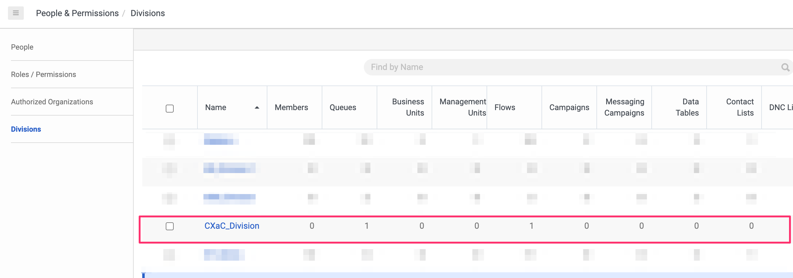
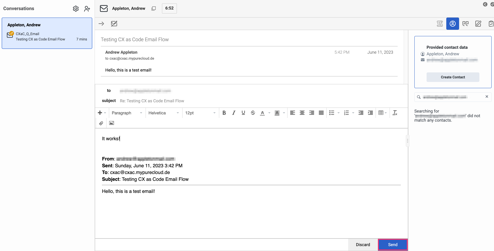
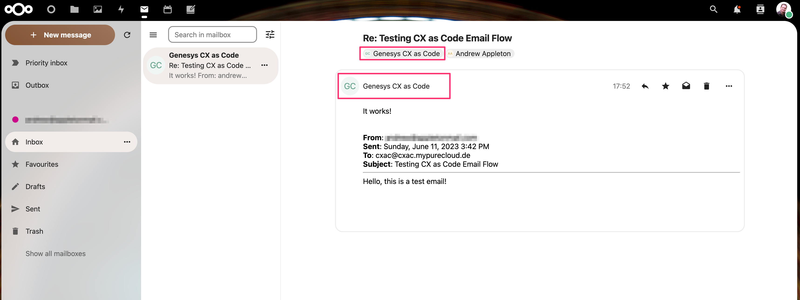

## Notes on *Email Project* example

## Initialize Terraform environment...

```
ara@anfield.local:cx-as-code-toi [main] $ cd 05-Email\ Project/
ara@anfield.local:05-Email Project [main *] $ terraform init

Initializing the backend...

Initializing provider plugins...
- Finding mypurecloud/genesyscloud versions matching ">= 1.14.0"...
- Installing mypurecloud/genesyscloud v1.16.0...
- Installed mypurecloud/genesyscloud v1.16.0 (signed by a HashiCorp partner, key ID 14124804A3595BCF)

Partner and community providers are signed by their developers.
If you'd like to know more about provider signing, you can read about it here:
https://www.terraform.io/docs/cli/plugins/signing.html

Terraform has created a lock file .terraform.lock.hcl to record the provider
selections it made above. Include this file in your version control repository
so that Terraform can guarantee to make the same selections by default when
you run "terraform init" in the future.

Terraform has been successfully initialized!

You may now begin working with Terraform. Try running "terraform plan" to see
any changes that are required for your infrastructure. All Terraform commands
should now work.

If you ever set or change modules or backend configuration for Terraform,
rerun this command to reinitialize your working directory. If you forget, other
commands will detect it and remind you to do so if necessary.

```
## Verify email domain exists
In GCX UI check in `Contact Center/Email` and verify that the email domain 
configured in the `terraform.tfvars` file exists (by default `cxac.mypurecloud.de`)


## Review execution plan...
```
ara@anfield.local:05-Email Project [main *] $ terraform plan
data.genesyscloud_user.cloud_user: Reading...
data.genesyscloud_routing_email_domain.email_domain: Reading...
data.genesyscloud_user.cloud_user: Read complete after 0s [id=5fb105a4-d44f-44f4-b931-a0fa265743ca]
data.genesyscloud_routing_email_domain.email_domain: Read complete after 0s [id=cxac.mypurecloud.de]

Terraform used the selected providers to generate the following execution plan. Resource actions are indicated with the following symbols:
  + create

Terraform will perform the following actions:

  # genesyscloud_auth_division.cxac_division will be created
  + resource "genesyscloud_auth_division" "cxac_division" {
      + description = "Division for CX as Code Demo"
      + id          = (known after apply)
      + name        = "CXaC_Division"
    }

  # genesyscloud_flow.simple_email_flow will be created
  + resource "genesyscloud_flow" "simple_email_flow" {
      + file_content_hash = "2bd6d8b88692db9fdec530eb282fef713cacf5e3560b1e00e7e00afe24652abf"
      + filepath          = "./CXaC_Email_Flow_v1-0.yaml"
      + id                = (known after apply)
    }

  # genesyscloud_routing_email_route.cxac_email_address will be created
  + resource "genesyscloud_routing_email_route" "cxac_email_address" {
      + domain_id  = "cxac.mypurecloud.de"
      + flow_id    = (known after apply)
      + from_email = "cxac@cxac.mypurecloud.de"
      + from_name  = "Genesys CX as Code"
      + id         = (known after apply)
      + pattern    = "cxac"
      + queue_id   = (known after apply)
    }

  # genesyscloud_routing_queue.cxac_routing_queue will be created
  + resource "genesyscloud_routing_queue" "cxac_routing_queue" {
      + acw_timeout_ms           = 300000
      + acw_wrapup_prompt        = "MANDATORY_TIMEOUT"
      + auto_answer_only         = true
      + description              = "Queue for CXaC routing email"
      + division_id              = (known after apply)
      + enable_manual_assignment = false
      + enable_transcription     = false
      + id                       = (known after apply)
      + members                  = [
          + {
              + ring_num = 1
              + user_id  = "5fb105a4-d44f-44f4-b931-a0fa265743ca"
            },
        ]
      + name                     = "CXaC_Q_Email"
      + skill_evaluation_method  = "BEST"
      + wrapup_codes             = (known after apply)
    }

Plan: 4 to add, 0 to change, 0 to destroy.

─────────────────────────────────────────────────────────────────────────────────────────────────────────────────────────────────────────────────────────

Note: You didn't use the -out option to save this plan, so Terraform can't guarantee to take exactly these actions if you run "terraform apply" now.
ara@anfield.local:05-Email Project [main *] $ 
```

## Execute Terraform script...
```
ara@anfield.local:05-Email Project [main *] $ terraform apply --auto-approve
data.genesyscloud_user.cloud_user: Reading...
data.genesyscloud_routing_email_domain.email_domain: Reading...
data.genesyscloud_routing_email_domain.email_domain: Read complete after 0s [id=cxac.mypurecloud.de]
data.genesyscloud_user.cloud_user: Read complete after 0s [id=5fb105a4-d44f-44f4-b931-a0fa265743ca]

Terraform used the selected providers to generate the following execution plan. Resource actions are indicated with the following symbols:
  + create

Terraform will perform the following actions:

  # genesyscloud_auth_division.cxac_division will be created
  + resource "genesyscloud_auth_division" "cxac_division" {
      + description = "Division for CX as Code Demo"
      + id          = (known after apply)
      + name        = "CXaC_Division"
    }

  # genesyscloud_flow.simple_email_flow will be created
  + resource "genesyscloud_flow" "simple_email_flow" {
      + file_content_hash = "2bd6d8b88692db9fdec530eb282fef713cacf5e3560b1e00e7e00afe24652abf"
      + filepath          = "./CXaC_Email_Flow_v1-0.yaml"
      + id                = (known after apply)
    }

  # genesyscloud_routing_email_route.cxac_email_address will be created
  + resource "genesyscloud_routing_email_route" "cxac_email_address" {
      + domain_id  = "cxac.mypurecloud.de"
      + flow_id    = (known after apply)
      + from_email = "cxac@cxac.mypurecloud.de"
      + from_name  = "Genesys CX as Code"
      + id         = (known after apply)
      + pattern    = "cxac"
      + queue_id   = (known after apply)
    }

  # genesyscloud_routing_queue.cxac_routing_queue will be created
  + resource "genesyscloud_routing_queue" "cxac_routing_queue" {
      + acw_timeout_ms           = 300000
      + acw_wrapup_prompt        = "MANDATORY_TIMEOUT"
      + auto_answer_only         = true
      + description              = "Queue for CXaC routing email"
      + division_id              = (known after apply)
      + enable_manual_assignment = false
      + enable_transcription     = false
      + id                       = (known after apply)
      + members                  = [
          + {
              + ring_num = 1
              + user_id  = "5fb105a4-d44f-44f4-b931-a0fa265743ca"
            },
        ]
      + name                     = "CXaC_Q_Email"
      + skill_evaluation_method  = "BEST"
      + wrapup_codes             = (known after apply)
    }

Plan: 4 to add, 0 to change, 0 to destroy.
genesyscloud_auth_division.cxac_division: Creating...
genesyscloud_auth_division.cxac_division: Creation complete after 0s [id=32c01ba2-7607-4a61-9e85-10745f3d5c71]
genesyscloud_routing_queue.cxac_routing_queue: Creating...
genesyscloud_routing_queue.cxac_routing_queue: Creation complete after 1s [id=bdace16c-d0e9-4f77-a2b1-2733500416c0]
genesyscloud_flow.simple_email_flow: Creating...
genesyscloud_flow.simple_email_flow: Still creating... [10s elapsed]
genesyscloud_flow.simple_email_flow: Still creating... [20s elapsed]
genesyscloud_flow.simple_email_flow: Creation complete after 20s [id=642192a4-3055-44ab-8c0d-748bfe478e90]
genesyscloud_routing_email_route.cxac_email_address: Creating...
genesyscloud_routing_email_route.cxac_email_address: Creation complete after 1s [id=f8a0d8c8-8f14-41ac-a2e8-6cee75b4270e]

Apply complete! Resources: 4 added, 0 changed, 0 destroyed.
ara@anfield.local:05-Email Project [main *] $ 
```

## Review created resources in GCX UI

### Division
Check that the new Division has been created, also note resources owned by the Division



### Email address 
Check that the email address has been with correct flow and queue in the correct domain


### Workflow
Email Architect workflow created with correct division ownership


### Queue
Check that the queue has been created along with appropriate members of queue


### Queue Members
Verify that expected members are part of the queue


### Active Queue
Log on as the agent configured in this demonstration and verify that the queue is available and active...


# Test 

## Go on queue
When you are happy that all resources have been correctly created it is time to test.
Log your agent on and go on-queue...


## Send test email
Send a test email from any working email account


## Receive email
Email should arrive at your agent.  This may become a little more accurate with a large room of attendees to the TOI... I will 
leave any fine-tuning of the routing logic to your capable hands! :smirk:


## Reply (optional)
If you wish, reply to the email...



## Customer receives email...
If you replied.. Note that the "Email From" friendly name should be as you configured it.



# Destroy resources (optional)
As this is just demo environment, go ahead and destroy tthe resources created 

```
ara@anfield.local:05-Email Project [main *] $ terraform destroy
data.genesyscloud_user.cloud_user: Reading...
data.genesyscloud_routing_email_domain.email_domain: Reading...
genesyscloud_auth_division.cxac_division: Refreshing state... [id=b4da6f42-5147-4b00-9ac0-80bf2f786837]
data.genesyscloud_routing_email_domain.email_domain: Read complete after 0s [id=cxac.mypurecloud.de]
data.genesyscloud_user.cloud_user: Read complete after 0s [id=5fb105a4-d44f-44f4-b931-a0fa265743ca]
genesyscloud_routing_queue.cxac_routing_queue: Refreshing state... [id=649cebcd-7a8a-4250-ba9b-35816d3a4df4]
genesyscloud_flow.simple_email_flow: Refreshing state... [id=b0bdba73-f113-4c9e-8774-f9ca3b5e45fa]
genesyscloud_routing_email_route.cxac_email_address: Refreshing state... [id=ed846314-088e-4061-a25c-3dc23550ee54]

Terraform used the selected providers to generate the following execution plan. Resource actions are indicated with the following symbols:
  - destroy

Terraform will perform the following actions:

  # genesyscloud_auth_division.cxac_division will be destroyed
  - resource "genesyscloud_auth_division" "cxac_division" {
      - description = "Division for CX as Code Demo" -> null
      - home        = false -> null
      - id          = "b4da6f42-5147-4b00-9ac0-80bf2f786837" -> null
      - name        = "CXaC_Division" -> null
    }

  # genesyscloud_flow.simple_email_flow will be destroyed
  - resource "genesyscloud_flow" "simple_email_flow" {
      - file_content_hash = "2bd6d8b88692db9fdec530eb282fef713cacf5e3560b1e00e7e00afe24652abf" -> null
      - filepath          = "./CXaC_Email_Flow_v1-0.yaml" -> null
      - id                = "b0bdba73-f113-4c9e-8774-f9ca3b5e45fa" -> null
    }

  # genesyscloud_routing_email_route.cxac_email_address will be destroyed
  - resource "genesyscloud_routing_email_route" "cxac_email_address" {
      - domain_id  = "cxac.mypurecloud.de" -> null
      - flow_id    = "b0bdba73-f113-4c9e-8774-f9ca3b5e45fa" -> null
      - from_email = "cxac@cxac.mypurecloud.de" -> null
      - from_name  = "Genesys CX as Code" -> null
      - id         = "ed846314-088e-4061-a25c-3dc23550ee54" -> null
      - pattern    = "cxac" -> null
      - priority   = 0 -> null
      - queue_id   = "649cebcd-7a8a-4250-ba9b-35816d3a4df4" -> null
      - skill_ids  = [] -> null
    }

  # genesyscloud_routing_queue.cxac_routing_queue will be destroyed
  - resource "genesyscloud_routing_queue" "cxac_routing_queue" {
      - acw_timeout_ms           = 300000 -> null
      - acw_wrapup_prompt        = "MANDATORY_TIMEOUT" -> null
      - auto_answer_only         = true -> null
      - default_script_ids       = {} -> null
      - description              = "Queue for CXaC routing email" -> null
      - division_id              = "b4da6f42-5147-4b00-9ac0-80bf2f786837" -> null
      - enable_manual_assignment = false -> null
      - enable_transcription     = false -> null
      - groups                   = [] -> null
      - id                       = "649cebcd-7a8a-4250-ba9b-35816d3a4df4" -> null
      - members                  = [
          - {
              - ring_num = 1
              - user_id  = "5fb105a4-d44f-44f4-b931-a0fa265743ca"
            },
        ] -> null
      - name                     = "CXaC_Q_Email" -> null
      - skill_evaluation_method  = "BEST" -> null
      - skill_groups             = [] -> null
      - teams                    = [] -> null
      - wrapup_codes             = [] -> null

      - media_settings_call {
          - alerting_timeout_sec      = 8 -> null
          - service_level_duration_ms = 20000 -> null
          - service_level_percentage  = 0.8 -> null
        }

      - media_settings_callback {
          - alerting_timeout_sec      = 30 -> null
          - service_level_duration_ms = 20000 -> null
          - service_level_percentage  = 0.8 -> null
        }

      - media_settings_chat {
          - alerting_timeout_sec      = 30 -> null
          - service_level_duration_ms = 20000 -> null
          - service_level_percentage  = 0.8 -> null
        }

      - media_settings_email {
          - alerting_timeout_sec      = 300 -> null
          - service_level_duration_ms = 86400000 -> null
          - service_level_percentage  = 0.8 -> null
        }

      - media_settings_message {
          - alerting_timeout_sec      = 30 -> null
          - service_level_duration_ms = 20000 -> null
          - service_level_percentage  = 0.8 -> null
        }
    }

Plan: 0 to add, 0 to change, 4 to destroy.

Do you really want to destroy all resources?
  Terraform will destroy all your managed infrastructure, as shown above.
  There is no undo. Only 'yes' will be accepted to confirm.

  Enter a value: yes

genesyscloud_routing_email_route.cxac_email_address: Destroying... [id=ed846314-088e-4061-a25c-3dc23550ee54]
genesyscloud_routing_email_route.cxac_email_address: Destruction complete after 0s
genesyscloud_flow.simple_email_flow: Destroying... [id=b0bdba73-f113-4c9e-8774-f9ca3b5e45fa]
genesyscloud_flow.simple_email_flow: Destruction complete after 0s
genesyscloud_routing_queue.cxac_routing_queue: Destroying... [id=649cebcd-7a8a-4250-ba9b-35816d3a4df4]
genesyscloud_routing_queue.cxac_routing_queue: Destruction complete after 6s
genesyscloud_auth_division.cxac_division: Destroying... [id=b4da6f42-5147-4b00-9ac0-80bf2f786837]
genesyscloud_auth_division.cxac_division: Destruction complete after 0s

Destroy complete! Resources: 4 destroyed.
ara@anfield.local:05-Email Project [main *] $ 
```

# All done...
Go on and terraform!